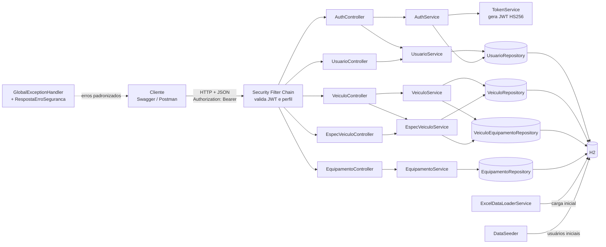
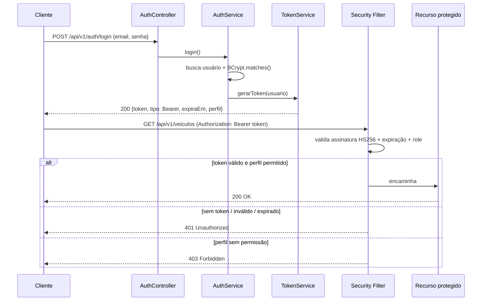

# Sprint 3 — Arquitetura Orientada a Serviços e Web Services

API REST em Spring Boot 4 que recebe marca, modelo, versão e uma lista livre de equipamentos
e devolve uma ficha técnica padronizada de veículos concorrentes. Protegida com JWT e perfis de acesso.

## Arquitetura



| Camada | Responsabilidade |
|---|---|
| Controller | Recebe HTTP, valida entrada (`@Valid`), devolve status code correto |
| Service | Regras de negócio (duplicidade, ficha padronizada, geração de token) |
| Repository | Acesso a dados via Spring Data JPA |
| Security | Autenticação (JWT), autorização por perfil, respostas 401/403 |
| Exception | Formato único de erro para toda a API |

## Fluxo de autenticação



## Perfis de acesso

| Perfil | Pode |
|---|---|
| ANALISTA | Consultar veículos, equipamentos e especificações |
| ADMIN | Tudo do analista + criar/editar/excluir veículos + listar usuários |

Usuários criados automaticamente: `admin@ford.com / admin123` e `analista@ford.com / analista123`.
O cadastro público (`/auth/registro`) sempre cria ANALISTA.

## Endpoints

| Método | Endpoint | Acesso | Sucesso | Erros |
|---|---|---|---|---|
| POST | `/api/v1/auth/login` | Público | 200 | 400, 401 |
| POST | `/api/v1/auth/registro` | Público | 201 | 400, 409 |
| GET | `/api/v1/usuarios` | ADMIN | 200 | 401, 403 |
| GET | `/api/v1/usuarios/me` | Autenticado | 200 | 401 |
| GET | `/api/v1/veiculos` | Autenticado | 200 | 401 |
| GET | `/api/v1/veiculos/{id}` | Autenticado | 200 | 401, 404 |
| POST | `/api/v1/veiculos` | ADMIN | 201 + Location | 400, 401, 403, 409 |
| PUT | `/api/v1/veiculos/{id}` | ADMIN | 200 | 400, 401, 403, 404, 409 |
| DELETE | `/api/v1/veiculos/{id}` | ADMIN | 204 | 401, 403, 404 |
| GET | `/api/v1/veiculos/{id}/especificacoes?equipamentos=...` | Autenticado | 200 | 400, 401, 404 |
| GET | `/api/v1/equipamentos?categoria=...` | Autenticado | 200 | 401 |
| POST | `/api/v1/especificacoes/consulta` | Autenticado | 200 | 400, 401, 404 |

### Formato padrão de erro
```json
{
  "timestamp": "2026-09-26T14:00:00Z",
  "status": 404,
  "erro": "Not Found",
  "mensagem": "Veículo não encontrado: id 99",
  "caminho": "/api/v1/veiculos/99",
  "detalhes": []
}
```

## Como executar

Pré-requisitos: Java 21. O Maven vem embutido (`mvnw`).

```bash
./mvnw spring-boot:run        # Linux/Mac
mvnw.cmd spring-boot:run      # Windows
```

- Swagger: http://localhost:8080/swagger-ui.html (login em `/auth/login` → botão **Authorize** → colar o token)
- Console H2: http://localhost:8080/h2-console (JDBC URL `jdbc:h2:file:./data/ford-db`, usuário `sa`)
- Para recarregar os dados do Excel, apague a pasta `data/` e reinicie.

## Testes

```bash
./mvnw test
```

Os testes cobrem cenários de sucesso, erro de validação, recurso inexistente, duplicidade,
acesso sem token (401) e acesso com perfil sem permissão (403).
Relatórios gerados em `target/surefire-reports/`.

## Integrantes
- Camila Mie Takara - RM555418
- Guilherme Barbiero - RM555185
- Marco Antonio Gonçalves - RM556818
- Matheus Cantiere - RM558479
- Vinicius Castro - RM556137